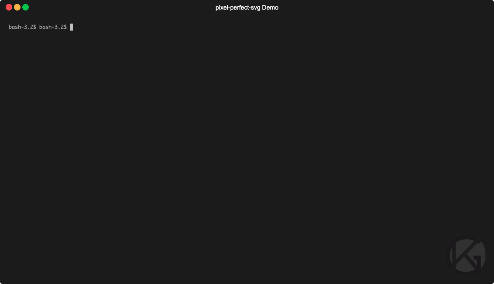

# pixel-perfect-svg

[](https://gist.github.com/kagof/51cfc9d8c5122fb3581c383ac3ba5a54)[](https://www.npmjs.com/package/pixel-perfect-svg)

This is a CLI written in Typescript as a yak shave for [IntelliJ Pokémon Progress Bar](https://github.com/kagof/intellij-pokemon-progress). It converts images (PNG, GIF, or JPEG) into an SVG with pixel perfect precision.

The original intended use case for this was creating easily scalable versions of pixel art images.



## Example

### Command

```bash
curl \
  https://upload.wikimedia.org/wikipedia/commons/9/93/I_C_Watermellon.png \
  --output - \
| psvg -p -o eg/example.svg
```

### Result

[](./eg/example.svg)

## Features

* handles PNG, GIF, and JPEG images
* handles alpha channel transparency, including partial
* can handle animated inputs by specifying a frame to look at (default is the first frame)
* can trim the output SVG
* input can be a filename or stdin, output can be a filename or stdout
* file size is somewhat optimized, can be further reduced by ensuring `--pretty` is off and turning `--no-metadata` on
* enhanced logging available with `--verbose`

## Installing the CLI

The CLI can be installed from NPM:

```bash
npm install -g pixel-perfect-svg
```

## Using the CLI

```bash
psvg --help # to print usage guide

psvg [ -i <input> | -o <output> | -F <frame> | -qVpmT | -l <amount> | -r
<amount> | -t  <amount> | -b  <amount> | -w  <amount> | -h  <amount>]

Options:
      --help             Show help                                     [boolean]
  -v, --version          Show version number                           [boolean]
  -i, --input            input PNG, JPEG, or GIF file                   [string]
  -o, --output           output SVG file                                [string]
  -F, --frame            frame of the input image to use   [number] [default: 0]
  -q, --quiet            turn off logging             [boolean] [default: false]
  -V, --verbose          turn on verbose logging      [boolean] [default: false]
  -p, --pretty           nicely format the output SVG [boolean] [default: false]
  -m, --no-metadata      do not add metadata tag      [boolean] [default: false]
  -T, --trim             trim blank space on output   [boolean] [default: false]
  -l, --max-left-trim    maximum amount to trim on the left             [number]
  -r, --max-right-trim   maximum amount to trim on the right            [number]
  -t, --max-top-trim     maximum amount to trim on the top              [number]
  -b, --max-bottom-trim  maximum amount to trim on the bottom           [number]
  -w, --min-width        minimum width of the image after trimming      [number]
  -h, --min-height       minimum width of the image after trimming      [number]

Examples:
  psvg -i in.png -o out.svg  input from arg, output to file
  psvg -o out.svg            input from stdin, output to file
  psvg -i in.png -q          input from arg, output to stdout (-q/--quiet
                             recommended)
  psvg -q                    input from stdin, output to stdout (-q/--quiet
                             recommended)

takes a PNG, GIF, or JPEG file and outputs a pixel perfect SVG
pixel-perfect-svg from https://github.com/kagof/pixel-perfect-svg
```

```bash
psvg -i input.png -o output.svg
```

```bash
cat input.png | psvg -q > output.svg
```

## Testing

This package uses `jest` for its tests. They can be run with

```bash
npm test
```

This will also run `ESLint`.
